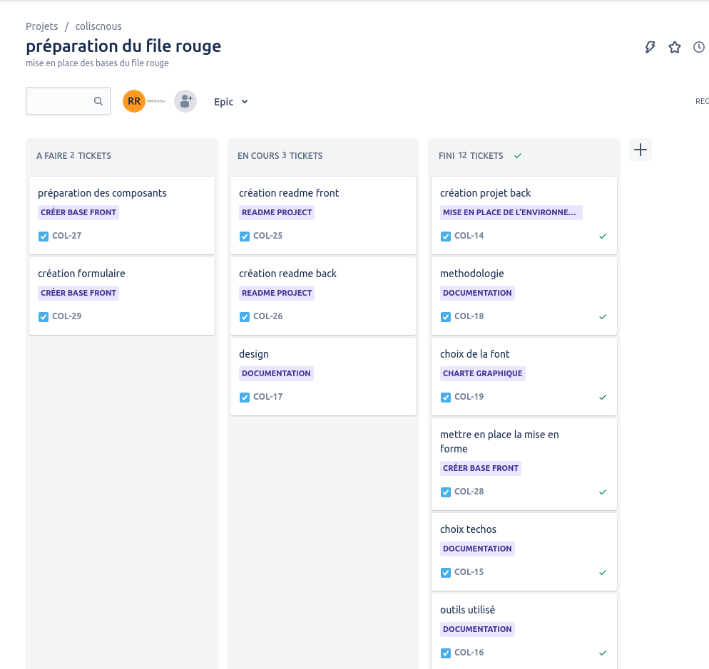
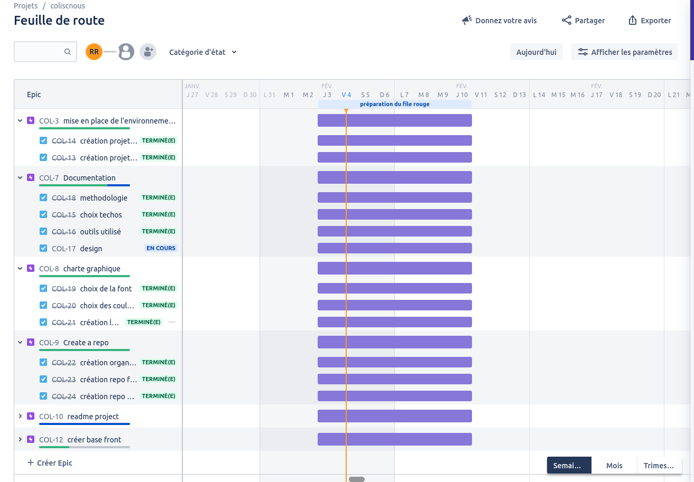
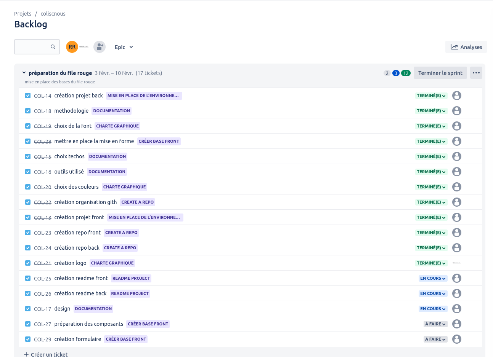

### Methodology used for the front-end:

```
The scrum methodology is the one we have adopted to complete our file rouge project.
```

---

<code></code>
<code></code>

```
Github is a tool that allowed us to work together, organize our code and have a remote repository.
```


<code></code>

```
Jira allowed us to organize the red file project, to extract the different epics and user stories from it. This allows us to have a roadmap on which to refer to carry out our work.
```



